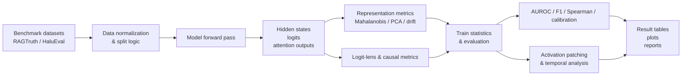
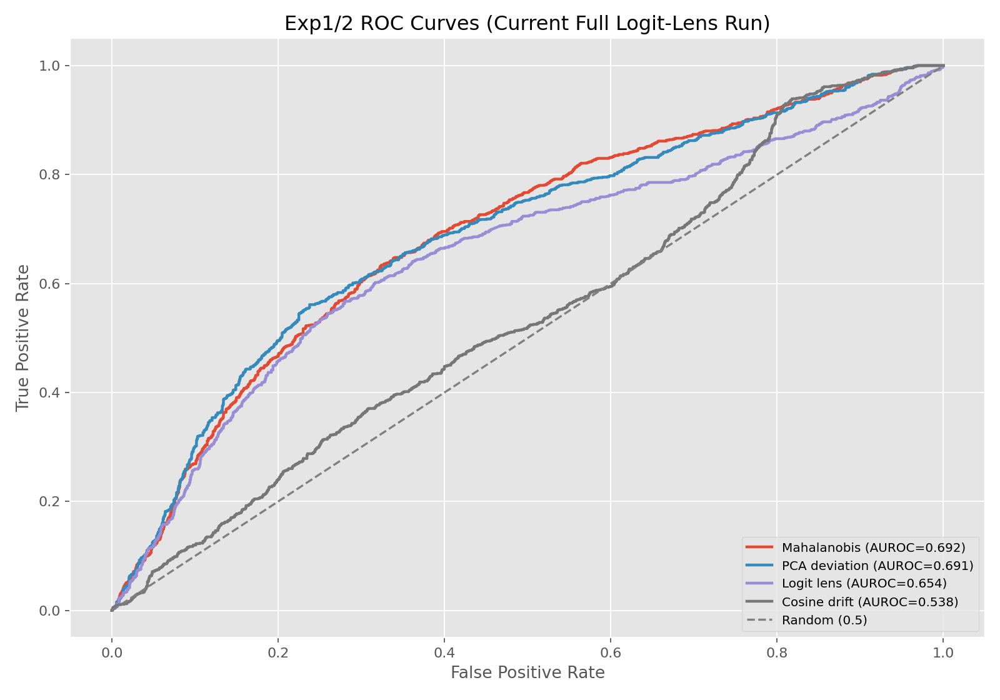
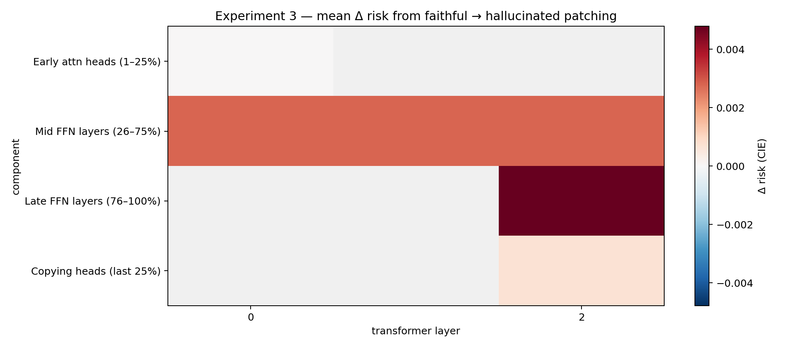
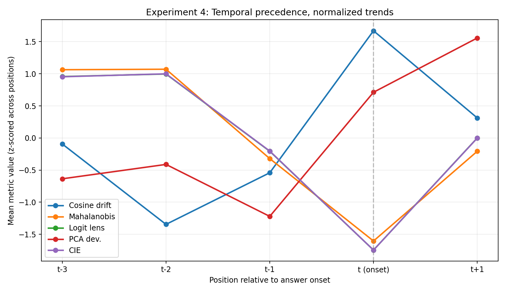

# Mechanistic Hallucination Detection in Language Models

This repository studies a problem that matters in real deployments of large language models: models can sound confident while producing facts that are unsupported by the provided context.

Instead of treating hallucination detection as a black-box output problem, this project investigates the model's internal state. The idea is simple but important: if hallucinations leave an internal trace, we can detect them earlier, explain them better, and potentially build safer systems.

The project combines benchmark evaluation, representation analysis, and mechanistic interpretability to answer a central question:

> Are hallucinations visible inside the model before they become obvious in the generated text?

## Why this project matters

LLMs are now used in search, summarization, coding, QA, and decision support. A single unsupported claim can mislead users, reduce trust, and create downstream errors. Most existing approaches either:

- analyze the final text only,
- compare against retrieval or external verification,
- or use coarse uncertainty estimates.

This project goes deeper. It asks whether we can identify hallucination-related behavior by inspecting the internal activations, hidden states, layer-wise signals, and causal effects inside the model itself.

That is important because better mechanistic understanding can lead to:

- earlier hallucination detection,
- more interpretable model diagnostics,
- stronger benchmark performance,
- and better reward / safety signals for model alignment workflows.

## High-level architecture



The pipeline follows this loop: raw benchmark data -> normalized samples -> model activations -> mechanistic metrics -> evaluation and interpretation -> outputs that explain both model behavior and detection performance.

## What the project measures

This repository computes a mix of classical and mechanistic hallucination signals, including:

- **Attention entropy baseline**: measures uncertainty in attention distributions.
- **Logit confidence baseline**: uses predictive confidence as a simple signal.
- **Cosine drift**: measures representation changes between context and answer states.
- **Mahalanobis distance**: compares activations against a faithful-answer reference distribution.
- **PCA deviation**: measures how far answer states move from the learned reliable subspace.
- **Logit-lens divergence**: looks for mismatches between intermediate-layer logits and final outputs.
- **Causal intervention effect (CIE)**: estimates how strongly internal states influence hallucination-related behavior.
- **Activation patching**: changes hidden states across examples to test causal relevance.
- **Temporal precedence analysis**: checks whether signals emerge before answer onset.
- **FFN vs. attention decomposition**: localizes whether feed-forward or attention components drive the signal.

This combination makes the codebase useful not only for ranking models but also for understanding where hallucination signals live inside the network.

## Key result highlights

The strongest final RAGTruth result is a **CIE full composite AUROC of 0.7224**, improving on the attention entropy baseline (**0.6661 AUROC**). That matters because it shows that internal-state methods can outperform simple confidence-style heuristics.

| Method | AUROC | F1 | Spearman | ECE |
| --- | ---: | ---: | ---: | ---: |
| Attention entropy baseline | 0.6661 | 0.6070 | 0.2843 | 0.0066 |
| Logit confidence baseline | 0.6650 | 0.6087 | 0.2824 | 0.0137 |
| Mahalanobis score | 0.6916 | 0.6159 | 0.3280 | 0.0363 |
| PCA deviation | 0.6910 | 0.6135 | 0.3269 | 0.0180 |
| Logit-lens divergence | 0.6536 | 0.6014 | 0.2628 | 0.0172 |
| CIE full composite | 0.7224 | 0.6090 | 0.3807 | 0.0467 |

### ROC comparison



This plot illustrates why the project is interesting: a series of internal, layer-aware metrics systematically separates faithful and hallucinated outputs better than a simple baseline.

### Layer-level mechanism localization



The activation patching analysis shows that **mid and late FFN layers** and certain copying heads carry especially strong causal signal. This is valuable because it suggests that hallucination-related behavior is not random noise: it is concentrated in specific parts of the transformer.

### Temporal signal analysis



This analysis explores whether suspicious activation patterns appear before answer onset. The project tests whether these signals can serve as early warning indicators rather than only retrospective explanations.

## Experiment overview

### Experiment 1 and 2: Representation and causal metric evaluation

These experiments compare uncertainty baselines against representation-based and causal metrics. The final result table reports AUROC, F1, Spearman correlation, and expected calibration error on the held-out test split.

### Experiment 3: Activation patching

This experiment replaces hidden states between faithful and hallucinated examples to estimate causality. It provides direct evidence that some components are more influential than others, which is a key step toward interpretable detection.

### Experiment 4: Temporal precedence

This experiment checks whether signals emerge before unsupported generation starts. If so, that would be especially useful for building safer generation pipelines or early intervention systems.

### Experiment 5: HaluEval transfer

The metrics are tested against multiple tasks and settings to see whether the signal transfers beyond one original benchmark. Transferability matters because a model-agnostic explanation is more useful in real deployments.

### Experiments 6-8: Localization, failure analysis, and SOTA comparison

These experiments break down the signal by component family, inspect failure modes, and compare performance against stronger published detectors. They help determine whether the project is merely achieving a benchmark bump or is uncovering a genuine mechanism.

## Repository structure

```text
.
├── data/                         # Benchmark data and lightweight repo fixtures
├── docs/                        # Documentation and curated visual assets
├── outputs/                     # Experiment tables, plots, and reports
├── scripts/                     # Reproducibility and analysis scripts
├── src/nlp_track_b/             # Core project code and model pipeline
├── tests/                       # Existing smoke tests for the pipeline
├── README.md                    # Project overview and usage
├── pyproject.toml               # Project metadata and dependencies
├── requirements.txt             # Dependency list
├── uv.lock                      # Lockfile for reproducible environments
└── .gitignore                   # Ignores large local/generated artifacts
```

## Quick start

Install dependencies:

```bash
python -m venv .venv
source .venv/bin/activate
pip install -r requirements.txt
```

Run the existing smoke test:

```bash
PYTHONPATH=src python3 -m unittest tests.test_person1_pipeline -q
```

## Example analysis commands

Generate model artifacts from a JSONL dataset:

```bash
python scripts/exp1_generate_artifacts.py \
  --dataset data/ragtruth/raw_subset.jsonl \
  --output-dir outputs/example_run \
  --provider mock \
  --save-format pt
```

Use a Hugging Face model backend:

```bash
python scripts/exp1_generate_artifacts.py \
  --dataset data/ragtruth/raw_subset.jsonl \
  --output-dir outputs/hf_run \
  --provider hf \
  --model-name distilgpt2 \
  --device auto \
  --compact-output \
  --save-format pt
```

Build the final Exp1/Exp2 table:

```bash
python scripts/build_exp12_table.py
```

Run activation patching:

```bash
python scripts/experiment3_activation_patching.py
```

Run temporal precedence analysis:

```bash
python scripts/run_experiment4_temporal_precedence.py
```

## Tech stack

- Python 3.12+
- PyTorch
- NumPy
- pandas
- scikit-learn
- SciPy
- Matplotlib
- Hugging Face-compatible model execution path

## Bottom line

This project sits at the intersection of LLM evaluation and mechanistic interpretability. It does not just ask whether a model is hallucinating at the output level; it asks whether the internal computation reveals the problem. That makes the project especially relevant for trustworthy AI, safety research, and model debugging.

In other words, this repo is not just a benchmark pipeline. It is a research system for understanding how hallucination looks inside the model and whether those signals can be turned into actionable, interpretable detection mechanisms.
